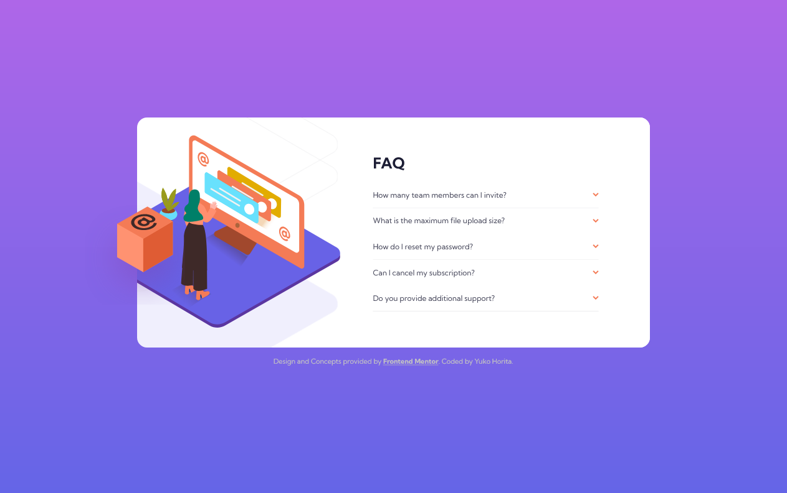
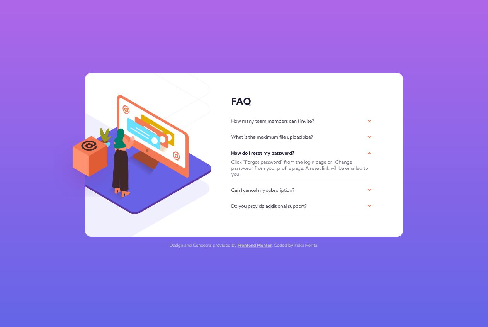

# Frontend Mentor - FAQ accordion card solution

This is a solution to the [FAQ accordion card challenge on Frontend Mentor](https://www.frontendmentor.io/challenges/faq-accordion-card-XlyjD0Oam). Frontend Mentor challenges help you improve your coding skills by building realistic projects.

## Table of contents

- [Overview](#overview)
  - [The challenge](#the-challenge)
  - [Screenshot](#screenshot)
  - [Links](#links)
- [My process](#my-process)
  - [Built with](#built-with)
  - [What I learned](#what-i-learned)
  - [Continued development](#continued-development)
  - [Useful resources](#useful-resources)
- [Author](#author)
- [Acknowledgments](#acknowledgments)

## Overview

This is to practice positioning elements by CSS and semantic HTML.
All interactive elements are focusable.
I used <details> widjet for the accordion and try not to use javaScript to expand/shrink them and rotate the arrows.

### The challenge

Users should be able to:

- View the optimal layout for the component depending on their device's screen size
- See hover states for all interactive elements on the page
- Hide/Show the answer to a question when the question is clicked

### Screenshot

- Mobile View (at 375px)
  

- Desktop View (at 1440px)
  

- Expanded Accordion on Desktop View
  

### Links

- Solution URL: [Frontend Mentor](https://www.frontendmentor.io/solutions/accordion-faq-PcBDevrLY)
- Live Site URL: [Vercel](https://accordion-card-kappa.vercel.app/)

## My process

### Built with

- Semantic HTML5 markup
- CSS custom properties
- Flexbox
- CSS Grid
- Mobile-first workflow

### What I learned

It was first time using <details> tag on html and css selectors to enable the accordion fully working.
The bonus challenge on this project was that only use HTML and CSS to achieve the accordion.

I spent a quite long time to positioning the images of woman and the background especially for desktop view. To hide the part of base structure in woman's illustration, I used

```css
overflow: hidden;
```

### Continued development

On the desktop view, I wanted to vertically center the card (white card) by using CSS grid, however the text inside the accordion can change the width when it's expanded.
In the future, I would like to improve more on positioning illustrations.

### Useful resources

- [MDN - <details>: The Details disclosure element](https://developer.mozilla.org/ja/docs/Web/HTML/Element/details) - This helped me to understand how to customise the defaul style and effects.
- [MDN - CSS selectors](https://developer.mozilla.org/en-US/docs/Web/CSS/CSS_Selectors)

## Author

- Frontend Mentor - [@sloth247](https://www.frontendmentor.io/profile/Sloth247)

## Acknowledgments
